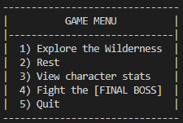

# Text-based Fighting Simulator
Players must explore and fight enemies to level up their characters in order to stand a chance against the final boss.

## Gameplay
Select from 3 different character classes: Novice, Knight, and Wizard.

The main menu allows the following options:

1. **Exploration**
    * The player has a chance of encountering enemies, mini-bosses, or nothing.
    * Engaging in a fight with an enemy triggers a 1v1 fight
      * Characters have a chance to miss, hit, or critically hit the enemy
      * Enemies have a lower chance to miss
      * Blocking has a chance for the character to regen health
    * Engaging in a fight with a mini boss is a team fight
      * Total damage is the combined attack of the live characters
      * The boss will randomly target a character to attack
2. **Rest**
    * All living characters are healed, but enemy attacks will become stronger
3. **View character stats**
    * Displays all info for each character
4. **Fight the final boss**
    * You may fight the boss at any time, but losing to the final boss will be a game over
5. **Quit**
